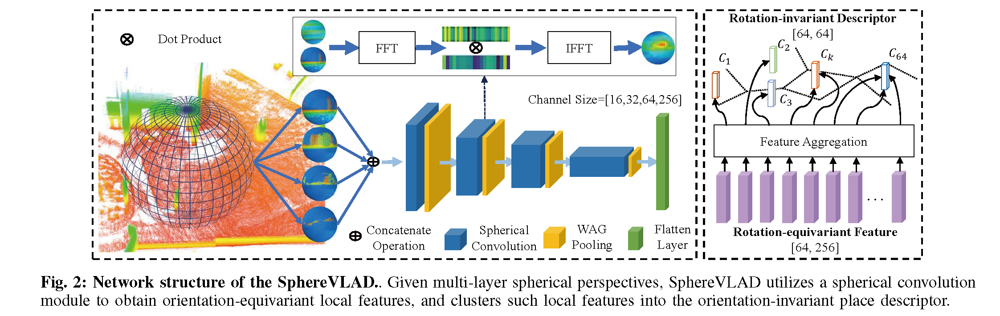
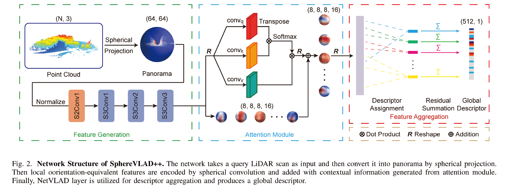

# SphereVLAD Series: Viewpoint-invariant Place Recognition
Pytorch implementation **SphereVLAD** and **SphereVLAD++** proposed in the papers: </br> 
[SeqSphereVLAD: Sequence Matching Enhanced Orientation-invariant Place Recognition](https://www.ri.cmu.edu/app/uploads/2020/11/0583.pdf) </br>
Peng Yin, Fuying Wang, Anton Egorov, Jiafan Hou, Ji Zhang, Howie Choset </br>
[SphereVLAD++: Attention-based and Signal-enhanced Viewpoint Invariant Descriptor](https://arxiv.org/abs/2207.02958) </br>
Shiqi Zhao, Peng Yin*, Ge Yi, Sebastian Scherer

### Network Structure



### Environment Dependency

**System**

The codes are tested in: </br>
* Ubuntu20.04+CUDA11.6+python3.8.10 </br>
* Ubuntu18.04+CUDA10.2+python3.6.9 </br>

**Python Environment Dependency**

* [s2cnn](https://github.com/jonkhler/s2cnn)
* torch==1.13.0+cu116 torchaudio==0.13.0+cu116 torchvision==0.14+cu116
* cupy-cuda11x==11.6.0

### Installation
It is highly recommended too create a virtual environment by **conda** or **virtualenv**.

```bash
# create virtual env
virtualenv /path_to_env/spherevlad -p /usr/bin/python3
source /path_to_env/spherevlad/bin/activate
# or
conda create -n spherevlad python==3.8
conda activate spherevlad

# install pytorch and cupy
pip3 install torch==1.13.0+cu116 torchvision==0.14.0+cu116 torchaudio==0.13.0 --extra-index-url https://download.pytorch.org/whl/cu116
pip3 install cupy-cuda11x==11.6.0

# install s2cnn
pip3 install pynvrtc joblib
mkdir third && cd third
git clone https://github.com/jonkhler/s2cnn.git
python setup.py install

# install all others packages
pip3 install -r requirements.txt
```

### Lidar Place Recognition

**Data Structure**

```
├── data 
    ├── results
    │   └── model_name
    │       ├── DATA.yaml
    │       ├── MODEL.yaml
    │       ├── log.txt
    │       └── pth
    │           ├── model_xxx.pth
    │           ├── ...
    └── dataset
        ├── PITT
        │   ├── DATA
        │   │   ├── Train1
        │   │   │   ├── cloudGlobal.pcd
        │   │   │   └── poses.txt
        │   │   ├── ...
        │   │   └── Trainxx
```

**Note**

Modify the ```PYTHONPATH``` environment variable to include absolute path to the project root folder:
```
export PYTHONPATH=$PATHONPATH:/path_to_spherevlad/SphereVLAD
```

**Data Preparation**

Download the sample data from [Dropbox](https://www.dropbox.com/scl/fi/45g8uns8gfmzmsxytjg2n/DATA.zip?rlkey=hs62zaaiub71f9g26ldhpyuir&dl=0) and put unzipped folder in the /data/PITT. The data structure should be like the same mentioned in **Data Structure** section.
```bash
mkdir data
python generating_sph/gene_pitt.py --config-network=config/network/spherevlad.yaml --config-dataset=config/dataset/PITT.yaml
```

**Training on Alita Urban Dataset**

```bash
# spherevlad
python3 train_lcd.py --config-network=config/network/spherevlad.yaml --config-dataset=config/dataset/PITT.yaml
# spherevlad2
python3 train_lcd.py --config-network=config/network/spherevlad2.yaml --config-dataset=config/dataset/PITT.yaml
```

* If there are issues with the s2cnn, please download the [version](https://www.dropbox.com/scl/fi/hvc809dymwwq4g3s4stoa/s2cnn.zip?rlkey=awal9vpauog6xfr3l6z4t5uam&dl=0) we have modified and tested.

* The generated weight will be saved at /data/results/SphereVLAD-{DatasetName}-{DD}-{MM}-{YYYY}-{TIME}, the folder also contains the log and configuration of the model and dataset.

**Testing on Alita Urban Dataset**

Pretrained weight on Alita Urban Dataset: [Dropbox](https://www.dropbox.com/scl/fi/wkidjpayjuepa124c22rv/SphereVLAD.zip?rlkey=ce50l1ypznlc131ftbwj30o6y&dl=0). Please unzip it and put in /data/results

Please change the trajectory numbers in *line 45* and *line 68* in **eval/evaluate_pitt.py** first.
```bash
# spherevlad
python eval/evaluate_pitt.py --model-path=data/results/SphereVLAD --epoch=666 --noise=1 --type=recall --trans-noise=2 --rot-noise=180 --log=False
# spherevlad2
python eval/evaluate_pitt.py --model-path=data/results/SphereVLAD2 --epoch=666 --noise=1 --type=recall --trans-noise=2 --rot-noise=180 --log=False
```
* --model-path: the folder contains the configuration and trained weights
* --epoch: the epoch of trained weights

### Hints on training and test on other dataset
* Modify the dataloader/pittsburgh.py to fit the data structure of your own dataset
* Modify the config/dataset/PITT.yaml to change the configuration of the dataset
* Add new evaluation methods in eval/eval_utils.py and import it in train_lcd.py

### Citation
```
@INPROCEEDINGS{9341727,
  author={Yin, Peng and Wang, Fuying and Egorov, Anton and Hou, Jiafan and Zhang, Ji and Choset, Howie},
  booktitle={2020 IEEE/RSJ International Conference on Intelligent Robots and Systems (IROS)}, 
  title={SeqSphereVLAD: Sequence Matching Enhanced Orientation-invariant Place Recognition}, 
  year={2020},
  volume={},
  number={},
  pages={5024-5029},
  doi={10.1109/IROS45743.2020.9341727}}
```
```
@ARTICLE{9956017,
  author={Zhao, Shiqi and Yin, Peng and Yi, Ge and Scherer, Sebastian},
  journal={IEEE Robotics and Automation Letters}, 
  title={SphereVLAD++: Attention-Based and Signal-Enhanced Viewpoint Invariant Descriptor}, 
  year={2023},
  volume={8},
  number={1},
  pages={256-263},
  doi={10.1109/LRA.2022.3223555}}
```
```
@article{yin2022alita,
  title={Alita: A large-scale incremental dataset for long-term autonomy},
  author={Yin, Peng and Zhao, Shiqi and Ge, Ruohai and Cisneros, Ivan and Fu, Ruijie and Zhang, Ji and Choset, Howie and Scherer, Sebastian},
  journal={arXiv preprint arXiv:2205.10737},
  year={2022}
}
```
